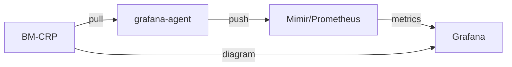

# Configuration du Monitoring



Les métriques sont exposées via un endpoint http pour le grafana-agent qui tourne en local sur le serveur bm-crp. Le grafana-agent push les données dans un serveur prometheus ou Mimir.
Grafana récupère les métriques via une Datasource Prometheus et le Diagram en Mermaid via un Endpoint http du monitoring dans bm-crp.

La création et mise à jour de la datasource et le diagram dans Grafana sont gérées par le monitoring dans bm-crp automatiquement.

# Server bm-crp

Le Monitoring est intégré dans le code du bm-crp. 

## Configuration rapide via bm-cli

Avec crp + grafana-agent sur une machine mae-crp1 & bm-grafana-stack sur une machine mae-grafana, la commande suivante lancée depuis bm-crp va configurer crp & grafana-agent correctement.

```
bm-cli forest configure \
    --grafana-datasource=http://mae-grafana.devenv.blue:9009/prometheus \
    --grafana-diagram-url=https://mae-crp1.devenv.blue \
    --grafana-host=mae-grafana.devenv.blue --grafana-port=3000 \
    --grafana-user=admin --grafana-password=admin --active=true
```

## Configuration de l'application

/etc/bm-crp/grafana.conf

```
grafana {
    server {
        host = "<grafana host/ip>"
        port = 3000 # <grafana_port>
        userInfo = "admin:admin"
    }
    datasource {
        url = "http://<mimir|prometheus host/ip>:9009/prometheus"
    }
    panel {
        contentUrl = "https://<bm-crp host/ip>"
    }
}
```

Les infos de userInfo sont utilisés pour créer un serviceAccount qui va effectuer les appels API.

## Configuration de grafana-agent

Après l'installation du grafana-agent, il faut le configurer comme service systemd :
https://grafana.com/docs/grafana-cloud/data-configuration/agent/agent_as_service/
avec comme paramètre  **--config.file=/etc/bm/grafana-agent.yaml**

/etc/bm/grafana-agent.yaml
```
server:
    log_level: warn
metrics:
    global:
        scrape_interval: 15s
    wal_directory: /tmp/wal
    configs:
        - name: bluemind agent
            remote_write:
                - url: http://<mimir|prometheus host/ip>:9009/api/v1/push
            scrape_configs:
                - job_name: "prometheus"
                  scheme: "http"
                  metrics_path: "monitoring/metrics_scraping"
                  static_configs:
                    - targets: ["localhost:8081"]
```

Relancer grafana-agent:
```
systemctl restart grafana-agent
```

# Server Prometheus/Mimir

Sur le serveur Prometheus/Mimir, il ne faut pas une configuration spécifique.
Le Monitoring est opérationnel avec Prometheus ou Mimir, vu que les 2 systèmes parlent le même protocole. 

# Server Grafana

Après avoir installé Grafana, il est nécessaire d'installer le plugin de diagram et 
relancer le serveur grafana.
```
grafana-cli plugins install jdbranham-diagram-panel
systemctl restart grafana-server
```
